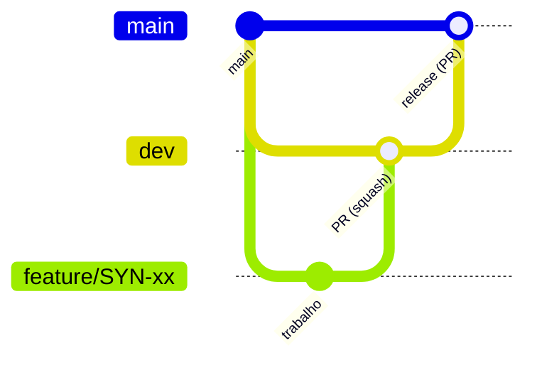

# Git flow

> Vale para os dois repos (front e back). SYN-87 · a partir de 24/09/2026.

## Branches

| branch | papel | como entra código |
|---|---|---|
| `main` | produção | só por PR vindo da `dev` (release) ou de um `hotfix/` |
| `dev` | integração | só por PR de `feature/` ou `fix/` |
| `feature/SYN-xx-descricao` | uma issue nova | sai da `dev` |
| `fix/SYN-xx-descricao` | correção de uma issue | sai da `dev` |
| `hotfix/SYN-xx-descricao` | bug urgente em produção | sai da `main` |



## Regras

- Ninguém faz commit direto em `main` nem em `dev`, e nunca force push nelas.
- **feature/fix → dev:** PR com a CI verde. Squash merge (um commit por issue na `dev`).
- **dev → main:** PR de release, com merge commit (não squash, senão `dev` e `main` divergem).
- **Hotfix:** PR de `hotfix/` para a `main` e, logo depois, `main` → `dev` para não perder a correção.
- Commit: `SYN-xx: descrição` em português.

## CI (o gate é o PR)

- **Front:** `npm ci`, `lint`, `typecheck` e `build` (check "lint · typecheck · build").
- **Back:** `./mvnw verify`, que compila e roda todos os testes (check "build · testes").

## Proteção no GitHub (`main` e `dev`)

PR obrigatório, check da CI obrigatório, sem force push e sem apagar a branch. Branch de feature é
apagada sozinha depois do merge.

- **Back:** já configurado.
- **Front:** o repo é da Izabelly, então quem ativa é ela: *Settings → Branches → Add rule* para
  `main` e `dev` com "Require a pull request", "Require status checks: lint · typecheck · build",
  "Do not allow bypassing" e sem force push/deleção; em *Settings → General*, marcar
  "Automatically delete head branches".

## Começar uma issue

```bash
git fetch origin
git switch -c feature/SYN-xx-descricao origin/dev
# ... commits ...
git push -u origin feature/SYN-xx-descricao   # e abre o PR para a dev
```
